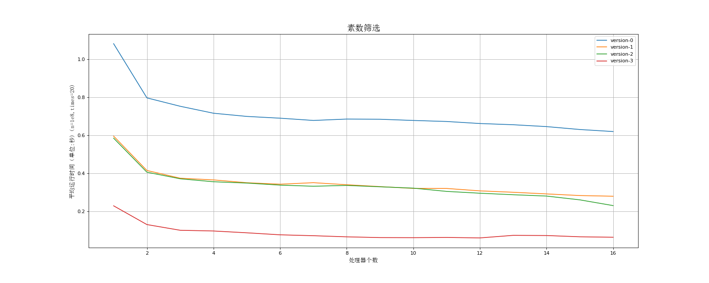
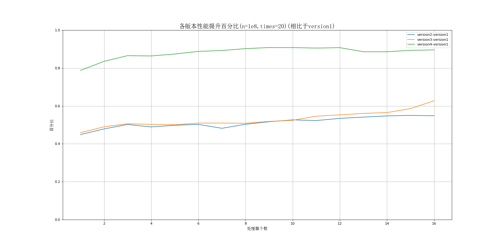
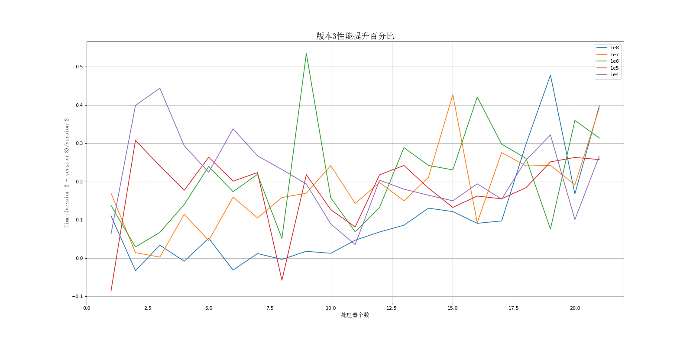

# 数筛选实验

### 文件结构

- bin : 可执行文件
- Data : 不同版本运行时间汇总
- img ：数据可视化图片
- perf : 程序执行细节信息工具（linux only）
- src : 源程序
  -  mpi-example.cpp : 老师给的mpi示例程序
  - sieve1~4.cpp : 四个迭代版本
  - command.py ：多次调用mpi执行函数，并存储执行时间
  - 数据处理.ipynb : 处理执行时间并生成图片

### 最终结果

##### 各个版本执行时间

##### 相比于原版提升百分比

##### 第三版比第二版在不同进程和不同数据规模下的提升

### 总结

基本完成实验要求
